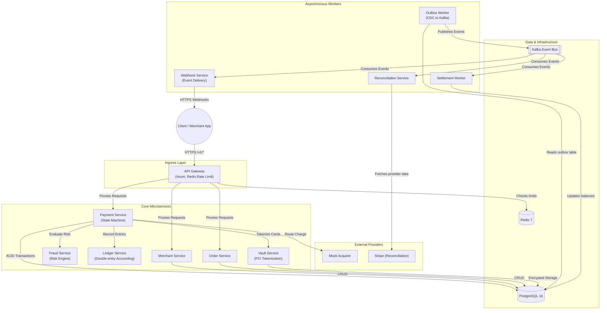

# System Architecture

The Rust Payment Gateway is designed as a high-throughput, horizontally scalable microservices architecture. It guarantees zero duplicate charges, perfect ledger accounting, and sub-second p99 latencies even under extreme load.

## High-Level Architecture Diagram

## Key Architectural Patterns

### 1. API Gateway & Edge Authentication
The API Gateway serves as the single entry point. It handles `Bearer` token authentication, maps API keys to internal `Merchant IDs`, and enforces strict Redis-backed rate limiting (up to 5,000 requests/second per merchant).

### 2. Transactional Outbox Pattern
To guarantee that business state changes (like capturing a payment) and event publishing (like sending a webhook) never fall out of sync, the system implements the **Transactional Outbox** pattern. 
When a payment is created, the payment row AND an outbox event are inserted into PostgreSQL within the same ACID transaction. The `Outbox Worker` then polls this table and reliably pushes the events to **Kafka**.

### 3. Idempotency Engine
To prevent duplicate charges on network retries, all critical endpoints require an `X-Idempotency-Key` header. The system uses a highly optimized `UPSERT` lock in PostgreSQL that guarantees a payload is only processed exactly once, returning the cached response on subsequent requests.

### 4. Double-Entry Immutable Ledger
Every financial movement (Capture, Refund, Fee, Settlement) is recorded in the `ledger_entries` table as a paired `debit` and `credit`. The ledger is completely immutable—database triggers aggressively prevent any `UPDATE` or `DELETE` operations on existing ledger rows, ensuring absolute financial compliance.

### 5. Circuit Breaking
Calls to external acquirers are wrapped in an in-memory Circuit Breaker to ensure that if an acquirer goes down, our gateway fails fast instead of hanging and exhausting connection pools.
