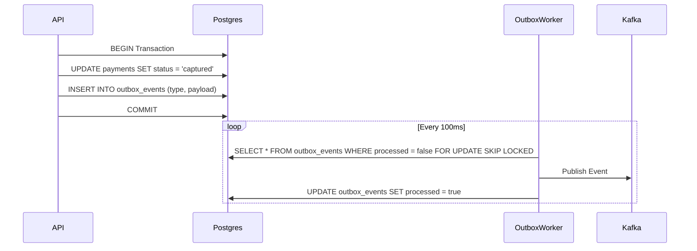

# Transactional Outbox Pattern

To ensure business state changes and asynchronous event notifications (webhooks) never diverge, the system utilizes the **Transactional Outbox** pattern.

## The Problem
If the API captures a payment and then attempts to push a `payment.captured` event to Kafka, the application could crash right between the database commit and the Kafka publish. The payment would be captured, but the event would be lost forever.

## The Solution
1. **ACID Transaction**: Both the `payments` row update AND an `outbox_events` row insert are executed in the same database transaction.
2. **Outbox Poller**: A background worker continuously polls the `outbox_events` table for unpublished events.
3. **Kafka Delivery**: The worker publishes the event to Kafka and marks the outbox row as `processed = true`.

## Flow

